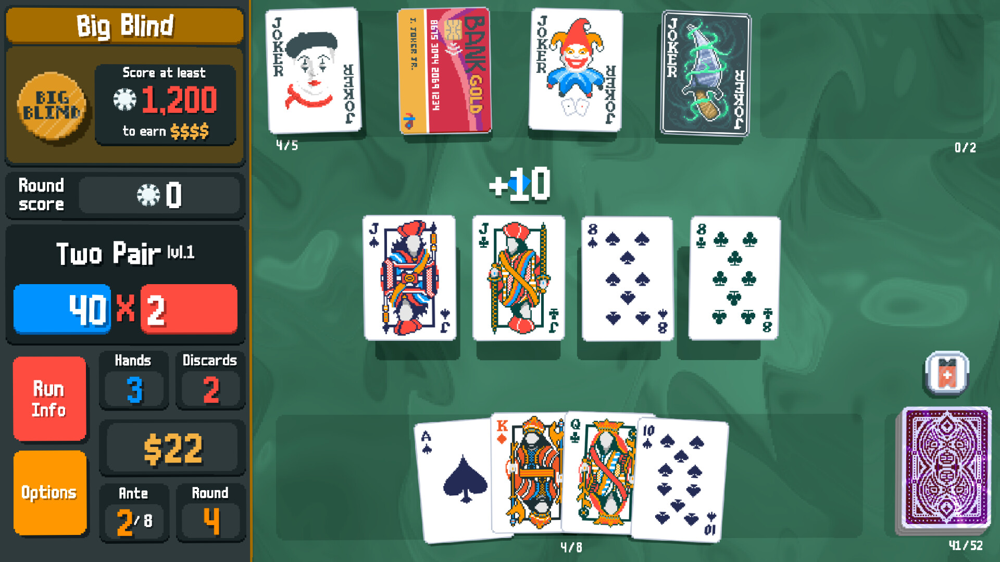

# Club de Videojuegos Retro

## Descripción

Este repositorio gestiona el inventario de un club de videojuegos retro, con un listado de juegos, versiones y precios actualizados.

## Instrucciones de instalación
1. Clona el repositorio: 
```bash
git clone https://github.com/tu_usuario/ClubVideojuegosRetro.git
```
2. Abre el archivo `inventario_juegos.txt` para ver el listado actual de juegos.

## Características
- Inventario actualizado
- Listado de juegos con copias disponibles
- Control de versiones para cambios en el inventario

## Página Oficial

[Visita nuestra página](https://github.com/RaulGarCan)

## Inventario

| Juego           | Plataforma   | Copias |
|-----------------|--------------|--------|
| Elden Ring      | PC           | 1      |
| Balatro         | Multi        | 2      |

### Juegos

#### Elden Ring


#### Gameplay
<a href="https://www.youtube.com/watch?v=PN7YFKHOR9Y&list=PL7RtZMiaOk8gdRf130w4gFYyhstL-5VRh">
    
</a>

#### Balatro


#### Gameplay
<a href="https://www.youtube.com/watch?v=obhqsZZBC8Q&list=PLXJogFfVQe0V8SILEouIXiTEP2IuQA0oU">
    
</a>